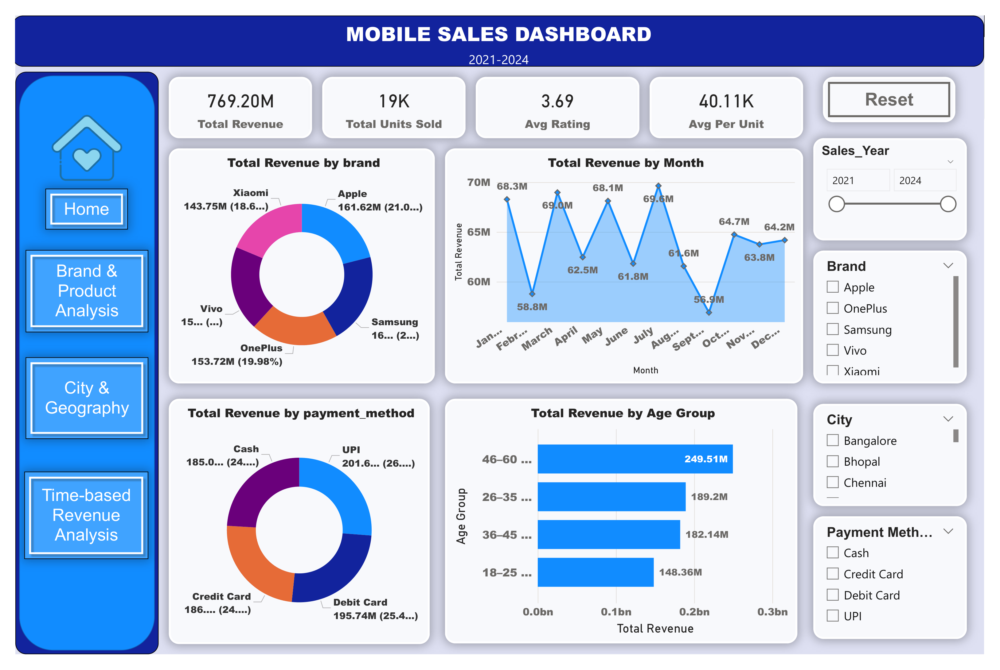
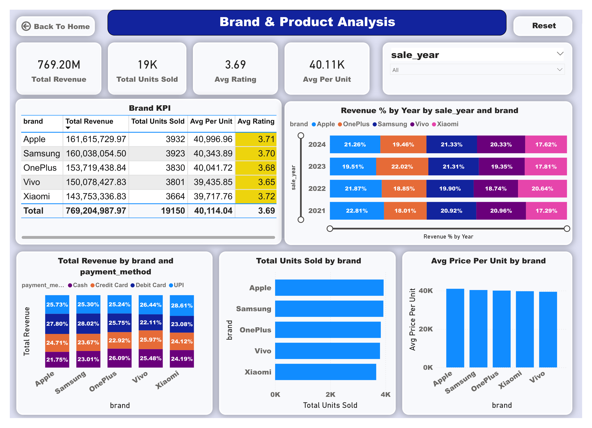
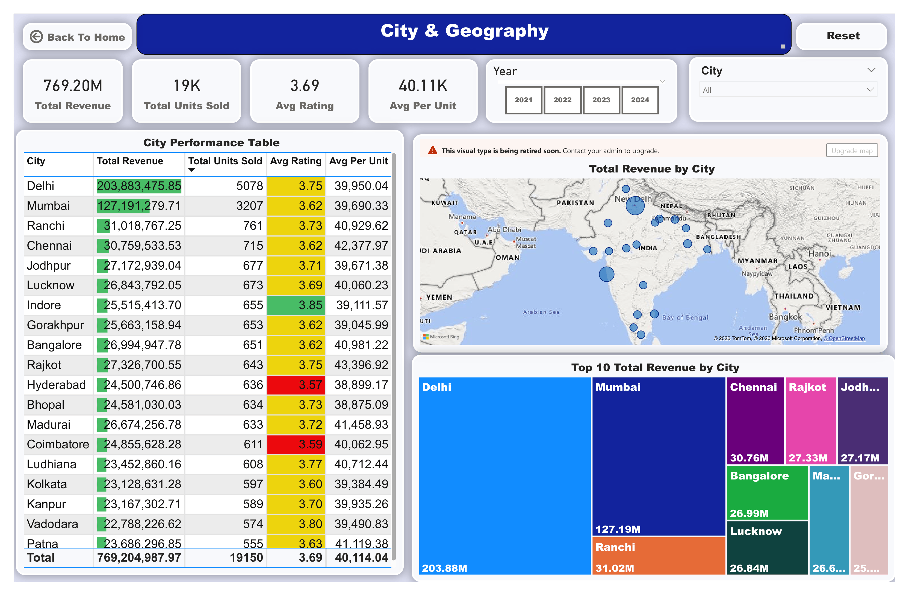
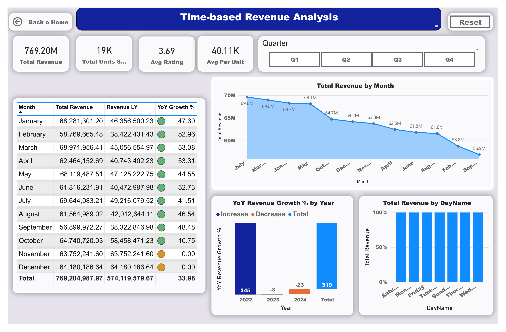

# 📱 Mobile Sales Data Analysis (MySQL + Power BI)

## 📌 Project Overview

End-to-end data analytics project using SQL and Power BI to analyze mobile sales data, uncover trends, and build interactive dashboards for business insights.

The dataset contains 3,835 transactions (2021–2024) across multiple brands, cities, and customer segments in India.

## 📊 Dataset Details

Total Records: 3,835

Time Period: 2021 – 2024

Brands: Apple, Samsung, OnePlus, Vivo, Xiaomi

Cities: 19 Indian cities

## Key Fields:

Transaction ID

Day

Month

Year

Brand 

Mobile Model

Units Sold 

Price

Customer Details (Name, Age)

City

Payment Method

Customer Rating

## 🛠️ Tools & Technologies
MySQL – Data cleaning & analysis

Power BI – Dashboard & visualization

SQL – Window functions, aggregations

## 📈 Key Analysis Performed

Total Revenue, Units Sold & Average Order Value

Top Performing Brands

Monthly Sales Trends & MoM Growth

City-wise Revenue Ranking

Best-Selling Mobile Models

Customer Segmentation

Payment Method Analysis

Repeat Customers

Revenue Contribution by Brand

High-Value Transactions

Running Total 

## 📊 Power BI Dashboard

Interactive dashboard built using Power BI to visualize:

Mobile sales Dashboard

Brand & Product Analysis

City & Geography Analysis

Time-based Revenue Analysis

## 📷 Dashboard Preview

### Mobile sales Dashboard

#### Insight:

Samsung is leading the market, while Apple is closely competing, indicating that the market is highly competitive.
→ Increase competitive offers, discounts, and focus on feature-based marketing.

The 46–60 age group generates the highest revenue, indicating that this segment has strong purchasing power and prefers premium products.
→ Target this group with tailored advertisements and offer service plans.

UPI accounts for the highest number of transactions, showing that customers are shifting toward digital payments.
→ Provide UPI cashback offers and ensure a fast checkout experience.
 
Sales peak in February and August, indicating higher demand during these periods.
→Plan marketing campaigns and stock inventory in advance of these months.

### Brand & Product Analysis

#### Insight:

Apple earns slightly more revenue than Samsung and also has higher price and better ratings, showing it is a premium brand.
→ Focus on quality, brand image, and premium features to compete.

Brands like Apple, Samsung, OnePlus, Vivo, and Xiaomi all sell almost the same number of units, so no brand dominates the market.
→ Use better offers, pricing, and features to stand out.

Most customers use UPI and Debit Cards for payment, showing a strong preference for digital payments.
→ Provide cashback offers and make payments fast and easy.

### City & Geography Analysis

#### Insight:

Delhi and Mumbai generate the highest revenue, contributing nearly 43% of total sales. Delhi alone leads with $203.88M.
→ Focus more marketing, premium products, and inventory in these cities to maximize revenue

Cities like Ranchi($31.02M) and Lucknow($28.84M) are generating strong revenue, even higher than bigger cities like Bangalore and Kolkata.
→ Increase presence, promotions, and distribution in Tier-2 cities to capture growing demand.

Time-based Revenue Analysis

#### Insight:

The business shows strong overall growth of 33.98% YoY, despite small drops in 2023 and 2024, indicating long-term stability.
→ Continue current strategies and invest more in expansion to maintain growth.

Revenue is highest between January and July, with July being the peak month($69.64M) . Sales start declining after September.
→ Focus marketing and product launches in the first half, and introduce offers to boost sales in the second half.

Revenue is evenly distributed across all days of the week, showing no weekend spike and steady demand.
→ Maintain consistent promotions and operations throughout the week instead of focusing only on weekends.

### 👤 Author
Sayali Sutar 

[GitHub](https://github.com/sayalisutar1001-DA)  
[LinkedIn](https://www.linkedin.com/in/sayali-sutar-0167273b4)

## 📁 Project Structure

- data/        → Contains dataset files  
- sql/         → SQL scripts for analysis  
- dashboard/   → Power BI dashboard file (.pbix)  
- images/      → Dashboard screenshots  
- README.md    → Project documentation  

